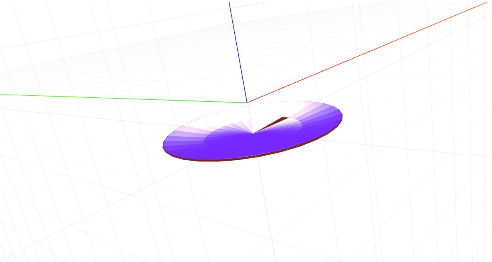

# craft-plate

# Install
`$ npm install craft-plate`

# Parameters
```sh
length - determines how long the plate lip is.
angle - determines the slope of the plate.
radius - determines how big the base of the plate is.
resolution - determines how many sides the plate has.
```

# Example

```html
<craft>
	<craft name="plate" module="craft-plate"/>
	<plate resolution="32"></plate>
</craft>
```

